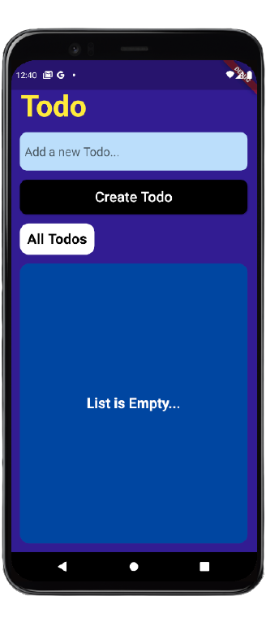
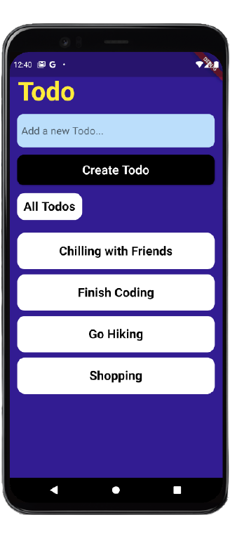

# todo_tutorial

Ever wondered, how it feels when you have the power to create? In this course, I'll help you discover that same power, only through Code.
Flutter is a beautiful framework built on top of dart. Combine it with firebase and you get a dependable ecosystem to develop cross-platform applications.
This course teaches you how to build a Todo Application using Flutter and Firebase and takes you deep into the intricacies of development, especially for beginners.

Here's how you can get started..

## Getting Started

1. Start by installing Flutter and setting it up as follows:
    a. Grab the latest Flutter SDK from [here](https://flutter.dev/docs/get-started/install)
    b. Extract the zip file in your desired location
    c. From the Start search bar, enter ‘env’ and select Edit environment variables for your account.
    d. Under User variables check if there is an entry called Path:
        If the entry exists, append the full path to flutter\bin using ; as a separator from existing values.
        If the entry doesn’t exist, create a new user variable named Path with the full path to flutter\bin as its value.
    e. Run "flutter doctor" from the terminal to check if the installation was correct.
2. Install Android Studio
3. Create a virtual device using AVD Manager.
4. Install VSCode, and add the following plugins once installation is complete:
    a. Flutter
    b. Dart
    c. Pubspec Assist

5. Create a new flutter project by typing "flutter create project_name" in the terminal

App Screenshots

